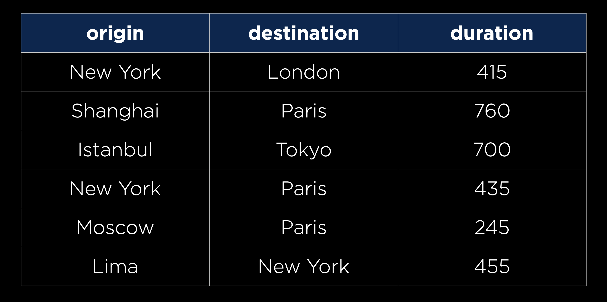

# SQL

## SQL-lite Types:
* TEXT
* NUMERIC
* INTEGER
* REAL
* BLOB (binary large object)


## MySQL Types
* CHAR(size)
* VARCHAR(size)
* SMALL INT
* INT
* BIGINT
* FLOAT
* DOUBLE
* ...

## SQL Commands

### CREATE TABLE

```sqlite
CREATE TABLE table_name (
    column1_name column1_type,
    column2_name column2_type,
    ...
);
```

Example:


```sqlite
CREATE TABLE flights (
    id INTEGER PRIMARY KEY AUTOINCREMENT,
    origin TEXT NOT NULL,
    destination TEXT NOT NULL,
    duration INTEGER NOT NULL
);
```

Where `PRIMARY KEY` refers to the unique identifier of the row, and `AUTOINCREMENT` is used to automatically increment
the value of the primary key.

### INSERT INTO
Allows me to add some data to a table

```sqlite
INSERT INTO flights
    (origin, destination, duration)
    VALUES ("New York", "London", 415);
```

I want to provide values for the columns `origin`, `destination`, and `duration` of the table `flights`."
The id column is automatically generated. The order is crucial.

### SELECT
Allows me to retrieve data from a table

* Selects all data from `flights` table
    ```sqlite
    SELECT * FROM flights;
    ```
* Select specific columns from `flights` table 
    ```sqlite
    SELECT origin, destination FROM flights;
    ```
* Select specific columns from `flights` table with a condition
    ```sqlite
    SELECT * FROM flights WHERE id = 3;
    ```

## First SQL file
1. Create it using `touch flights.sql` on the terminal
2. Use `sqlite3 flights.sql` to open the sqlite3 shell for `flights`
3. CREATE TABLE
4. INSERT various queries INTO to the table
5. Use SELECT to retrieve data from the table.
6. Note: Use `.mode columns` and `.headers yes` to make the output more readable.
   * |id | origin  |  destination    | duration |
     |-- | -------- | -------------  |----------|
     |  1 |  NY       | London        | 415     
     |  2  | New York  | London        | 415     
      | 3  | Tokyo     | San Francisco  |540     
      |  4  | Paris     | New York       |435     
      |  5  | Sydney    | Los Angeles    |840     
      |  6  | Berlin    | Rome           |115
7. Use SELECT to filter: `SELECT * FROM flights WHERE origin = "Berlin" AND duration > 115;`
8. Use SELECT to filter: `SELECT * FROM flights WHERE origin LIKE "%a%";` -> where there is an "a" in the origin name.


```sql
# Entering into the SQLite Prompt
(base) % sqlite3 flights.sql
SQLite version 3.26.0 2018-12-01 12:34:55
Enter ".help" for usage hints.

# Creating a new Table
sqlite> CREATE TABLE flights(
   ...>     id INTEGER PRIMARY KEY AUTOINCREMENT,
   ...>     origin TEXT NOT NULL,
   ...>     destination TEXT NOT NULL,
   ...>     duration INTEGER NOT NULL
   ...> );

# Listing all current tables (Just flights for now)
sqlite> .tables
flights

# Querying for everything within flights (Which is now empty)
sqlite> SELECT * FROM flights;

# Adding one flight
sqlite> INSERT INTO flights
   ...>     (origin, destination, duration)
   ...>     VALUES ("New York", "London", 415);

# Checking for new information, which we can now see
sqlite> SELECT * FROM flights;
1|New York|London|415

# Adding some more flights
sqlite> INSERT INTO flights (origin, destination, duration) VALUES ("Shanghai", "Paris", 760);
sqlite> INSERT INTO flights (origin, destination, duration) VALUES ("Istanbul", "Tokyo", 700);
sqlite> INSERT INTO flights (origin, destination, duration) VALUES ("New York", "Paris", 435);
sqlite> INSERT INTO flights (origin, destination, duration) VALUES ("Moscow", "Paris", 245);
sqlite> INSERT INTO flights (origin, destination, duration) VALUES ("Lima", "New York", 455);

# Querying this new information
sqlite> SELECT * FROM flights;
1|New York|London|415
2|Shanghai|Paris|760
3|Istanbul|Tokyo|700
4|New York|Paris|435
5|Moscow|Paris|245
6|Lima|New York|455

# Changing the settings to make output more readable
sqlite> .mode columns
sqlite> .headers yes

# Querying all information again
sqlite> SELECT * FROM flights;
id          origin      destination  duration
----------  ----------  -----------  ----------
1           New York    London       415
2           Shanghai    Paris        760
3           Istanbul    Tokyo        700
4           New York    Paris        435
5           Moscow      Paris        245
6           Lima        New York     455

# Searching for just those flights originating in New York
sqlite> SELECT * FROM flights WHERE origin = "New York";
id          origin      destination  duration
----------  ----------  -----------  ----------
1           New York    London       415
4           New York    Paris        435
```

### UPDATE
Change some value of and specific row in the table.

```sqlite
UPDATE flights
  SET duration = 430
  WHERE origin = "NY"
  AND destination = "London";
```

### DELETE
Delete the rows that satisfy the condition

```sqlite
DELETE FROM flights WHERE duration > 150;
```

### Other Clauses:
* LIMIT -> limits the number of rows returned
* ORDER BY -> orders the rows returned
* GROUP BY -> groups the rows returned
* HAVING  -> allows for additional constraints based on the number of results
* ...

## SQL Relationships

### Foerign keys

So far, we’ve only been working with one table at a time, but many databases in practice are populated by a number of tables that all relate to each other in some way. In our flights example, let’s imagine we also want to add an airport code to go with the city. The way our table is currently set up, we would have to add two more columns to go with each row. We would also be repeating information, as we would have to write in multiple places that city X is associated with code Y.

One way we can solve this problem is by deciding to have one table that keeps track of flights, and then another table keeping track of airports. The second table might look something like this

### flights table
id|origin|destination|duration
|--|------|-----------|--------
1|NY|London|415
2|New York|London|415
3|Tokyo|San Francisco|540
4|Paris|New York|435
5|Sydney|Los Angeles|840
6|Berlin|Rome|115
7|New York|London|420
8|Shanghai|Paris|780
9|Istanbul|Tokyo|710
10|New York|Paris|440
11|Moscow|Paris|250
12|Lima|New York|460
13|Berlin|Rome|120
14|Tokyo|San Francisco|550
15|Sydney|Los Angeles|850

### airports table
id|city|name
--|----|----
1|NY|JFK
2|London|Heathrow
3|San Francisco|SFO
4|Paris|Charles de Gaulle
5|Los Angeles|LAX
6|Rome|Fiumicino
7|Shanghai|Pudong
8|Istanbul|Ataturk
9|Tokyo|Narita


Instead of storing the city name in the `flights` table, we can store the `id` of the city in the `airports` table.

### new flights table

id| origin_id | destination_id |duration
--|-----------|----------------|--------
1| 1         | 2              |415
2| 1         | 2              |415
3| 9         | 3              |540
4| 4         | 1              |435
5| 5         | 6              |840

In addition to flights and airports, an airline might also want to store data about its passengers, like which flight each passenger will be on. Using the power of relational databases, we can add another table that stores first and last names, and a foreign key representing the flight they are on

### passengers

id|first|last|flight_id
--|-----|----|---------
1|Alice|Adams|1
2|Bob|Brown|2
3|Charlie|Chaplin|2
4|David|Dobbs|3
5|Eve|Edwards|4
6|Frank|Frost|5


### Limitation - One-to-One
Any particular row can **only** have one value for a `flight_id` foreign key. 
This is a **one-to-one** relationship.

### One-to-Many
We can do even better than this though, as the same person may be on more than one flight. To account for this, we can create a people table that stores first and last names, and a passengers table that pairs people with flights

### people table

id|first|last
--|-----|----
1|Alice|Adams
2|Bob|Brown
3|Charlie|Chaplin
4|David|Dobbs
5|Eve|Edwards

### passengers table -> assosiation table
The person with an `person_id` has a flight of `flight_id` 

id| person_id |flight_id
--|-----------|---------
1| 1         |1
2| 2         |2
3| 3         |2
4| 4         |3
5| 5         |4
6| 5         |3
7| 2         |1


because in this case a single person can be on many flights and a single flight can have many people, we call the relationship between flights and people a Many to Many relationship. The passengers table that connects the two is known as an association table.

## JOIN Query

Although our data is now more efficiently stored, it seems like it may be harder to query our data. Thankfully, SQL has a JOIN query where we can combine two tables for the purposes of another query.

```sqlite
SELECT first, origin, destination
FROM flights JOIN passengers
ON passengers.flight_id = flights.id;
```

This query returns 
* the first name of the passenger, 
* the origin of the flight, 
* the destination of the flight

for each row in the `flights` table that has a corresponding row in the `passengers` table 
where the `flight_id` of the `passengers` table matches the `id` of the `flights` table.

