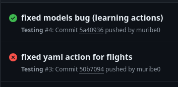

# CI/CD

Continuous Integration
* Frequent merges to `main` branch
* Automated tests

One online repository and everyone works in their own branch.
But very frequently all the branches are merged to the `main` branch. This is called Continuous Integration.

Be thoughtful about the tests you write.

Continuous Deployment
* Short release schedules


# Automate test

1. We first begin by adding a `.yml` file in `app_name/.github/workflows/` (see example in airline project)
2. Fill the file with instructions:
```yaml
     name: Testing
     on: push # This runs every time someone pushed their work to github

     jobs:
      test_project: # we define a job
       runs-on: ubuntu-latest # in which vm it will run on github servers
       stepts: # steps when it runs
        - uses: actions/checkout@v2 # this is a github action that checks out the code
        - name: Run Django unit test # description of what will happen
        run: |
          pip3 install --user django
          python3 manage.py test flights.tests
```
3. We then add the new files modified (ex: models, a view file, tests file, etc)
4. Commit and push normally
5. We then go into Github and the repository. The Actions tab and check whether the test worked


6. **It worked!** Fixed a bug after creating the yaml action and it run green after pushing the fix.

# Docker

1. Create `Dockerfile` and fill it with instructions of how you would create a container.
```dockerfile
FROM python:3
COPY . /usr/src/app
WORKDIR /usr/src/app
RUN pip install -r requirements.txt
CMD ["python", "manage.py", "runserver", "0.0.0.0:8000"]
```

` COPY . /usr/src/app` copies anything in `.` (current directory) into `/usr/src/app` in the container.
`WORKDIR /usr/src/app` sets the working directory to `/usr/src/app` in the container.
`RUN pip install -r requirements.txt` installs the requirements in the container.
`CMD ["python", "manage.py", "runserver", "0.0.0.0:8000"]` runs the server in the container.

Anyone using the same dockerfile will have the same environment.

For the database, we can use `docker-compose.yml` file to create a database container.
That is, so that we can have a database container and a django container running at the same time but separated.

2. Create a `docker-compose.yml` file and fill it with instructions of how you would create a database container.
```yaml
version: '3'

services:
  db:
    image: postgres

  web:
    build: .
    volumes:
      - .:/usr/src/app
    ports:
      - "8000:8000"

```

* Specify that we’re using version 3 of Docker Compose
* Outline two services:

- db sets up our database container based on an image already written by Postgres.
- web sets up our server’s container by instructing Docker to:
  - Use the Dockerfile within the current directory.
  - Use the specified path within the container.
  - Link port 8000 within the container to port 8000 on our computer.

