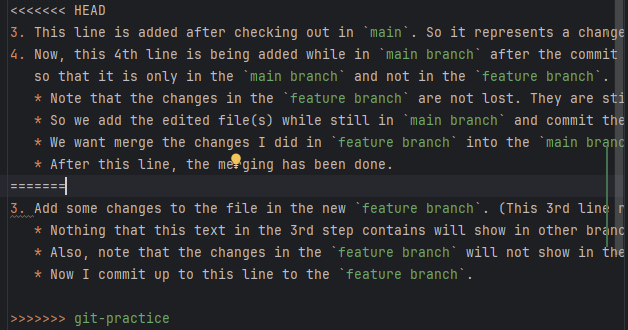

This is a test for learning branching on git.

1. Use `git branch` to see where you are.
2. Use `git checkout -b <branch-name>` to checkout and create a new branch.

3. This line is added after checking out in `main`. So it represents a change on the master branch while the new branch is also being modified. Add some changes to the file in the new `feature branch`. (This 3rd line represents that). Then, commit it to the feature branch.
   * Nothing that this text in the 3rd step contains will show in other branches. It only is happening in the `feature branch` as I am typing it in the `feature branch`.
   * Also, note that the changes in the `feature branch` will not show in the `master branch` until you merge the `feature branch` into the `master branch`.
   * Now I commit up to this line to the `feature branch`.
4. Now, this 4th line is being added while in `main branch` after the commit of step 3 to the `feature branch`. The idea is that the changes commited in `feature branch` have not been pushed. So we are going to commit this 4th line 
   so that it is only in the `main branch` and not in the `feature branch`.
   * Note that the changes in the `feature branch` are not lost. They are still there in `feature branch`. We are just adding a new commit to the `main branch` that is not in the `feature branch`.
   * So we add the edited file(s) while still in `main branch` and commit the changes.
   * We want merge the changes I did in `feature branch` into the `main branch` now. We use `git merge <feature-branch>` while in the `main branch` to do so.
   * After this line, the merging has been done.
5. Finally, we solve any conflicts as shown in the image bellow. The key here is that te conflic originated due to some lines being edited and not pushed in both branches.
   * Now, after they are resolved, we can commit from the `main branch` and push the changes to the remote repository.

